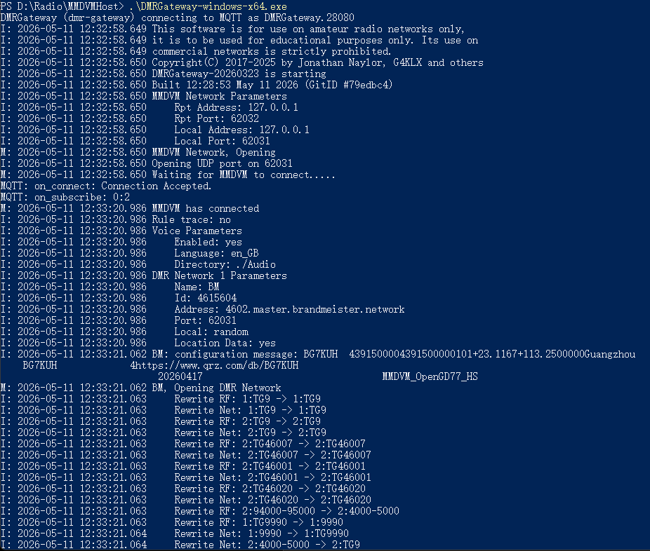

# DMRGateway-Builds

This repository builds precompiled binaries of the upstream **DMRGateway** project for multiple platforms using **GitHub Actions**, then publishes those binaries to a GitHub Release when you push a version tag.

Upstream source repo: https://github.com/g4klx/DMRGateway

## How it works

The workflow in [.github/workflows/build.yml](.github/workflows/build.yml) does three things:

1. **Build on Linux (matrix)**
	 - Targets:
		 - `linux-x86_64-gcc`
		 - `linux-x86_64-clang`
		 - `linux-arm64-gcc` (built inside an `ubuntu:22.04` arm64 container using QEMU)
	 - Installs dependencies via `apt`, then runs `make` in the upstream repo.
	 - Uploads a per-job artifact that contains the `DMRGateway` binary and a `build.log`.

2. **Build on Windows (matrix)**
	 - Targets:
		 - `windows-x86` (Win32)
		 - `windows-x64`
	 - Installs dependencies via **vcpkg** (static triplets) and builds the upstream `DMRGateway.vcxproj` with MSBuild.
	 - Uploads a per-job artifact that contains `DMRGateway.exe` and a `build.log`.

3. **Publish a Release (tags only)**
	 - When the workflow is triggered by a tag like `v0.1.0`, it downloads all build artifacts, renames binaries to unique filenames (so they don’t overwrite each other), and uploads them as Release assets.
	 - Example asset names:
		 - `DMRGateway-linux-x86_64-gcc`
		 - `DMRGateway-linux-x86_64-clang`
		 - `DMRGateway-linux-arm64-gcc`
		 - `DMRGateway-windows-x86.exe`
		 - `DMRGateway-windows-x64.exe`

## Usage

### Build on GitHub Actions

1. Fork this repository.
2. (Optional) Adjust platforms/compilers in [.github/workflows/build.yml](.github/workflows/build.yml).
3. Push a tag starting with `v`.

	 Example:
	 - `git tag v0.1.1`
	 - `git push origin v0.1.1`

4. Open the **Actions** page and wait for the workflow to finish.
5. Open the **Releases** page for the tag — the built binaries will be attached as assets.

### Manual run (no Release)

You can also run the workflow from the GitHub UI using **Run workflow** (workflow_dispatch). This will build and upload workflow artifacts, but it will not publish a GitHub Release unless you run it on a `v*` tag.

## Outputs

- **Workflow artifacts** (per job):
	- `build.log`
	- the built binary (`DMRGateway` or `DMRGateway.exe`)
- **Release assets** (tags only): uniquely named binaries for each platform/variant.

## Using the built binaries

This repo only builds/publishes binaries. How you configure and run DMRGateway depends on your MMDVM setup and network definitions.

Basics (from the upstream program’s CLI):

- Show version:
	- Windows: `DMRGateway.exe --version`
	- Linux: `./DMRGateway --version`

- Run with a config file:
	- `DMRGateway [filename]`

Default config file location:

- Windows: `DMRGateway.ini` in the current working directory
- Linux: `/etc/DMRGateway.ini`

For configuration details (ini sections, network definitions, rewrite rules), refer to the upstream project documentation: https://github.com/g4klx/DMRGateway
